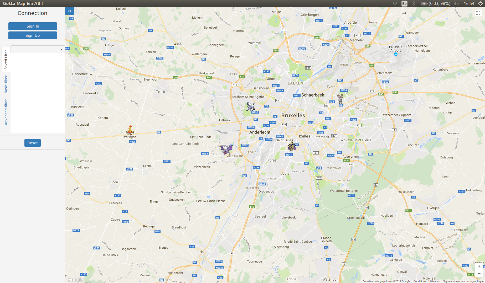
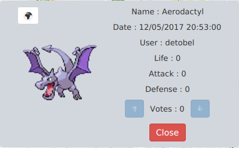
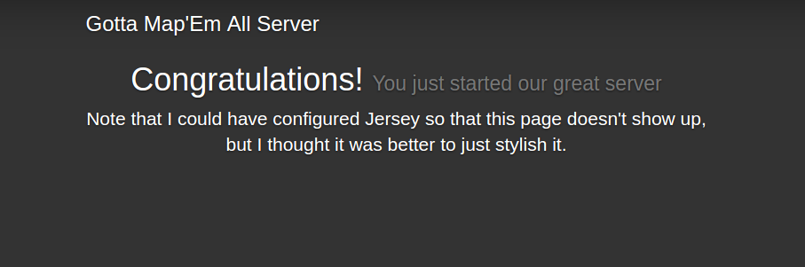
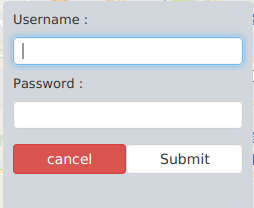
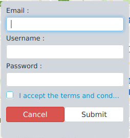
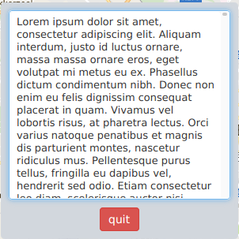
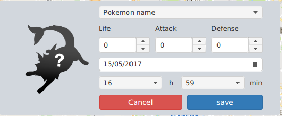

# Gotta Map'Em All : Projet de génie logiciel et gestion de projet (INFO-F-307)

Le projet a pour but de permettre à un joueur d'un jeu tel que `Pokemon Go` de signaler aux autres utilisateurs de cette même application
les pokemons qu'il rencontre.  Ce programme se veut donc fonctionnel sur les trois OS le plus connus/utilisés (Linux, Windows et MacOS).


# Utilisations

## Dépendances

Pour *fonctionner* (à partir d'un `.jar` déjà compilé), le projet a besoin des librairies suivantes :

 - [Java Runtime Environment 8](http://www.oracle.com/technetwork/java/javase/downloads/jre8-downloads-2133155.html), pour exécuter le code Java
 - [SQLite 3](https://sqlite.org/download.html), pour gérer la base de données
 - [GlassFish](http://www.oracle.com/technetwork/middleware/glassfish/overview/index.html), pour gérer le serveur REST
 
Pour *compiler*, il faut également disposer de :

 - [Java Development Kit 8](http://www.oracle.com/technetwork/java/javase/downloads/jdk8-downloads-2133151.html), pour compiler le code Java
 - [Maven 3](https://maven.apache.org/download.cgi), permettant de gérer la structure et les dépendances du code 
 - [Jersey](https://jersey.java.net/)

Pour *tester*, il faut également dispoer de :
 - [JUnit](http://junit.org/junit4/)


## Compilation

Une version du code source déjà compilée et compatible avec les plate-formes visées se trouve dans le dossier `dist/` du projet.

Afin de compiler le code source, exécuter la commande suivante à la racine du projet :  
```mvn compile```

## Démarrage 

### Serveur
Le serveur fonctionne avec GlassFish.  Pour démarrer GlassFish vous pouvez utilisez la commande suivante:
```
~/GlassFish_Server/bin/asadmin start-domain --verbose <domaine>
```
Où `<domaine>` représente le domaine que vous avez configuré (par défaut: `domain1`).          
          
Pour ensuite déployez le projet, utilisez la commande suivante:
```
~/GlassFish_Server/bin/asadmin deploy ./dist/server.war
```


### Client

Pour lancer l'exécution du programme côté client, il suffit d'exécuter :  
```java -jar client.jar```


# Configuration

## Client
La configuration se trouve ici: `assets/client/config.properties`            
Elle se présente comme ceci:
```properties
term-and-condition=terms_and_conditions.txt
bootstrap=bootstrap.css
icon5=icons/application_icon_512.png
icon4=icons/application_icon_256.png
icon3=icons/application_icon_128.png
icon2=icons/application_icon_64.png
icon1=icons/application_icon_32.png
icon0=icons/application_icon_16.png
title=Gotta Map'Em All \!
sprites=sprites/
unknown-pokemon=unknown_pokemon.png
server-url=http\://localhost\:8080/server/rest/
```


## Serveur
La configuration se trouve ici: `assets/server/config.properties`             
Elle se présente comme ceci:
```properties
database-name=Database.db
test-database-name=TestDatabase.db
SQL-script=Database.sql
```

# Tests
Les tests se trouvent dans le dossier `test/` où il est expliqué les convensions décidées à ce sujet.           
Les tests fonctionnent avec Junit.


# Misc

## License

[THE BEER-WARE LICENSE (Revision 42)](https://people.freebsd.org/~phk/)

## Screenshot

                      
                      
                      
                      
                      
                      
                      
